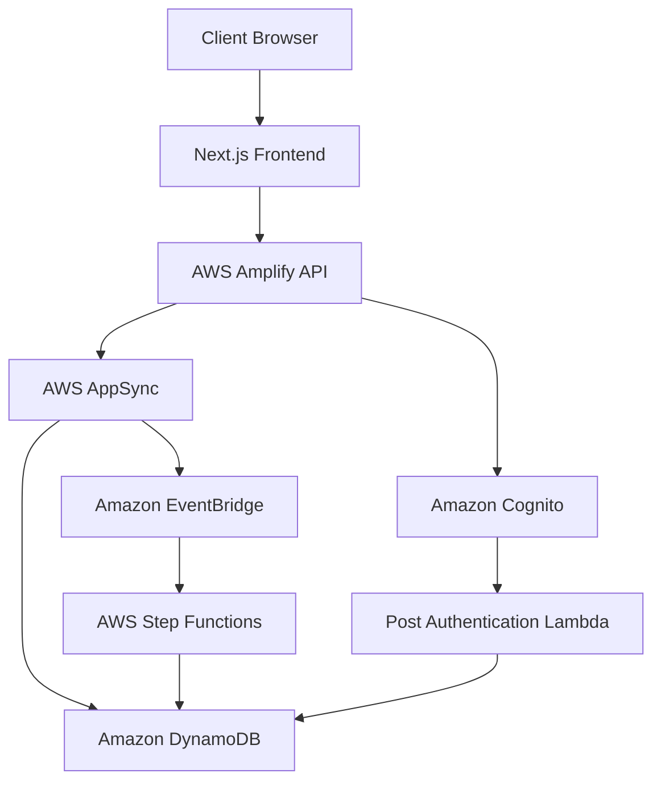

# Promptz Architecture

## System Architecture Overview

Promptz follows a modern serverless architecture built on AWS Amplify Gen 2, leveraging various AWS services to create a scalable, maintainable, and secure application.

## Key Components

### Frontend Layer

- **Next.js Application**: Server-side rendered React application using the App Router
  - Server Components for data fetching and rendering
  - Client Components for interactive elements
  - Tailwind CSS with Shadcn UI for styling

### API Layer

- **AWS AppSync**: GraphQL API for data operations
  - Handles authentication and authorization
  - Resolvers for data operations

### Authentication Layer

- **Amazon Cognito**: User authentication and management
  - Passwordless authentication
  - Custom email templates for verification
  - Post-authentication triggers for user creation

### Data Layer

- **Amazon DynamoDB**: NoSQL database for storing application data
  - Tables for users, prompts, stars, and project rules
  - Secondary indexes for efficient queries
  - Point-in-time recovery (in production)
  - Deletion protection (in production)

### Event Processing Layer

- **Amazon EventBridge**: Event bus for handling application events
  - Custom event bus for Promptz events
  - Event patterns for different event types
- **AWS Step Functions**: Workflow orchestration for event processing
  - State machines for handling prompt interactions

### Monitoring Layer

- **Amazon CloudWatch**: Monitoring and logging (in production)
  - API logs for AppSync operations
  - Metric filters for prompt operations
  - Custom metrics for business analytics

## Architecture Characteristics

### Security

- **Authentication**: Cognito user pools with secure password policies
- **Authorization**: Fine-grained access control at the model level
- **API Security**: API keys with expiration for public access
- **Owner-based Access**: Data access restricted to owners for private content

### Scalability

- **Serverless Architecture**: Auto-scaling based on demand
- **DynamoDB**: On-demand capacity for handling traffic spikes
- **Event-driven Design**: Decoupled components for independent scaling

### Reliability

- **Data Durability**: DynamoDB with point-in-time recovery in production
- **Event Processing**: Reliable event delivery with EventBridge
- **Error Handling**: Proper error handling in API resolvers

### Performance

- **Edge Caching**: Content delivery optimization
- **Efficient Queries**: Secondary indexes for optimized data access
- **Server Components**: Reduced client-side JavaScript

## Design Patterns

### Event-Driven Architecture

Implemented using EventBridge for decoupled communication between components.

### Next.js server actions for data fetching and mutations

Separation of read and write operations in the Next.js server actions layer.

### Component-Based Design

UI built with reusable components for consistency and maintainability.

### Serverless Pattern

Leveraging managed services to reduce operational overhead.

## Data Flow

### Prompt Creation Flow

1. User creates a prompt through the UI
2. Next.js server action validates the input
3. AppSync mutation creates the prompt in DynamoDB
4. Success/error response returned to the user

### Prompt Interaction Flow

1. User interacts with a prompt (copy, star, etc.)
2. Event published to EventBridge
3. Step Function workflow triggered to process the event
4. Analytics updated based on the interaction

### Authentication Flow

1. User signs in through the UI
2. Cognito authenticates the user
3. Post-authentication Lambda creates/updates user record
4. User session established with appropriate permissions

## Integration Points

- **Frontend to Backend**: GraphQL API calls from Next.js to AppSync
- **Authentication to Data**: Post-authentication Lambda to DynamoDB
- **Events to Processing**: EventBridge to Step Functions
- **API to Events**: Custom resolvers to EventBridge

## Future Architecture Considerations

- **Analytics Pipeline**: Enhanced analytics processing AWS Step Functions
- **Search Capabilities**: Integration with OpenSearch or Amazon Aurora Serverless for advanced queries and search.
