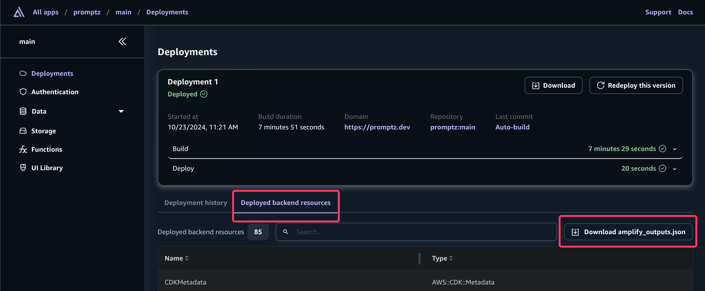

# Promptz

[](http://commitizen.github.io/cz-cli/)
[](./CODE_OF_CONDUCT.md)
[](https://github.com/prettier/prettier)

Promptz is the ultimate prompting hub for Amazon Q Developer, designed to help you discover, create, and perfect your prompts for every step of the software development lifecycle.

## Table of Contents

- [Prerequisites](#-prerequisites)
- [Getting Started](#-getting-started)
- [Contributing](#contributing)
- [License](#license)

## 📝 Prerequisites

- [Create an AWS account](https://portal.aws.amazon.com/gp/aws/developer/registration/index.html) if you do not already have one and log in.
- [Configure AWS for local development](https://docs.amplify.aws/nextjs/start/account-setup/) with Amplify

Before you begin, make sure you have the following installed:

- Node.js v14.x or later
- npm v6.14.4 or later
- git v2.14.1 or later

## 🚀 Getting Started

Promptz is built with AWS Amplify Gen 2 and next.js.

### 1. Clone the repository

```
git clone https://github.com/cremich/promptz.git
cd promptz
```

### 2. Deploy the app in your AWS account

Now that the repository has been created, deploy it with Amplify in your own AWS account.

[](https://console.aws.amazon.com/amplify/create/repo-branch)

Select **Start with an existing app > GitHub.** After you give Amplify access to your GitHub account via the popup window, pick the repository and `main` branch to deploy. Make no other changes and click through the flow to Save and deploy.

### 3. View deployed app

While you are waiting for your app to deploy (~5 mins).Learn about the project structure

- `amplify/` Contains Amplify backend configuration
- `/app`: Next.js app router pages and layouts
- `/components`: React components used throughout the application
- `/contexts`: React context providers
- `/hooks`: Custom React hooks
- `/models`: Data models and types
- `/public`: Static assets
- `/utils`: Utility functions and helpers

When the build completes, visit the newly deployed branch by selecting "View deployed URL".

### 4. Set up local environment

Click on your deployed branch and you will land on the Deployments page which shows you your build history and a list of deployed backend resources.



Now move the `amplify_outputs.json` file you downloaded above to the root of your project.

Install all required dependencies via `npm install`.

### 6. Start a local development server

Run `npm rund dev` to start a local development server using the amplify configuration downloaded in step 4.

After starting the development server, open your browser and navigate to `http://localhost:3000`.

### 6. Setup local AWS credentials

To make backend updates, Amplify requires AWS credentials to deploy backend updates from your local machine. Follow the official Amplify documentation to [configure AWS for local development](https://docs.amplify.aws/nextjs/start/account-setup/).

### 7. Deploy cloud sandbox

To update your backend without affecting the production branch, use Amplify's cloud sandbox. This feature provides a separate backend environment for each developer on a team, ideal for local development and testing.

Follow the official Amplify documentation to [setup sandbox environments](https://docs.amplify.aws/nextjs/deploy-and-host/sandbox-environments/.setup/)

## Contributing

We welcome contributions to Promptz! Please see our [Contributing Guidelines](CONTRIBUTING.md) for more information on how to get started.

## License

This project is licensed under the MIT License. See the [LICENSE](LICENSE) file for details.

## Learn More

To learn more about the technologies used in this project, check out the following resources:

- [Next.js Documentation](https://nextjs.org/docs)
- [AWS Amplify Documentation](https://docs.amplify.aws/)
- [Cloudscape Design System](https://cloudscape.design/)
