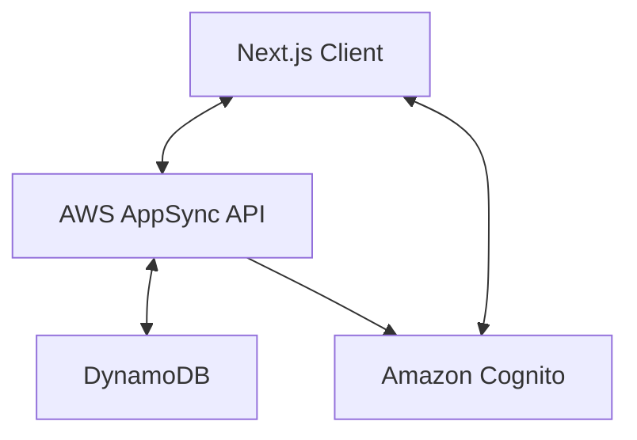
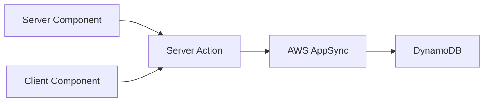
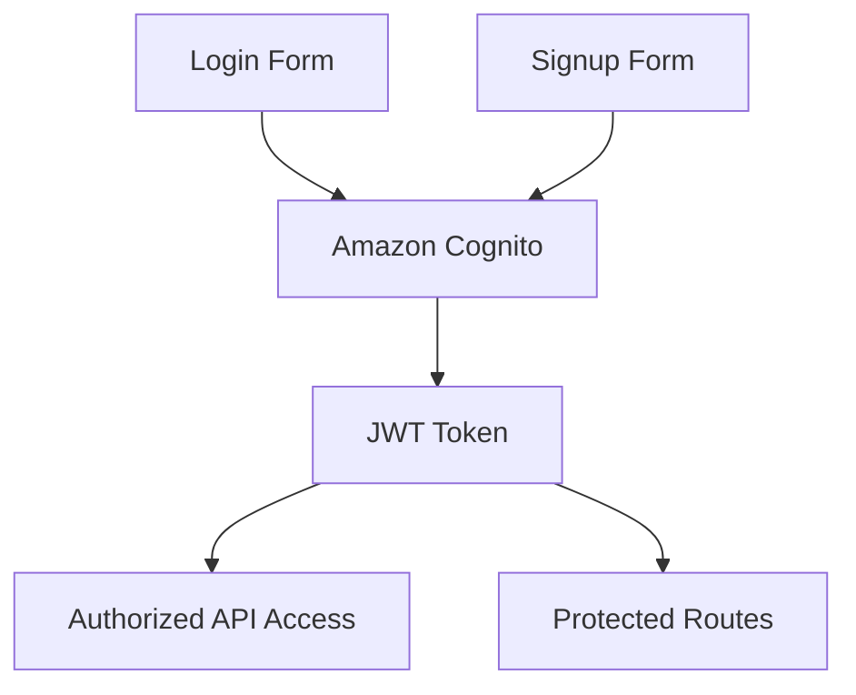
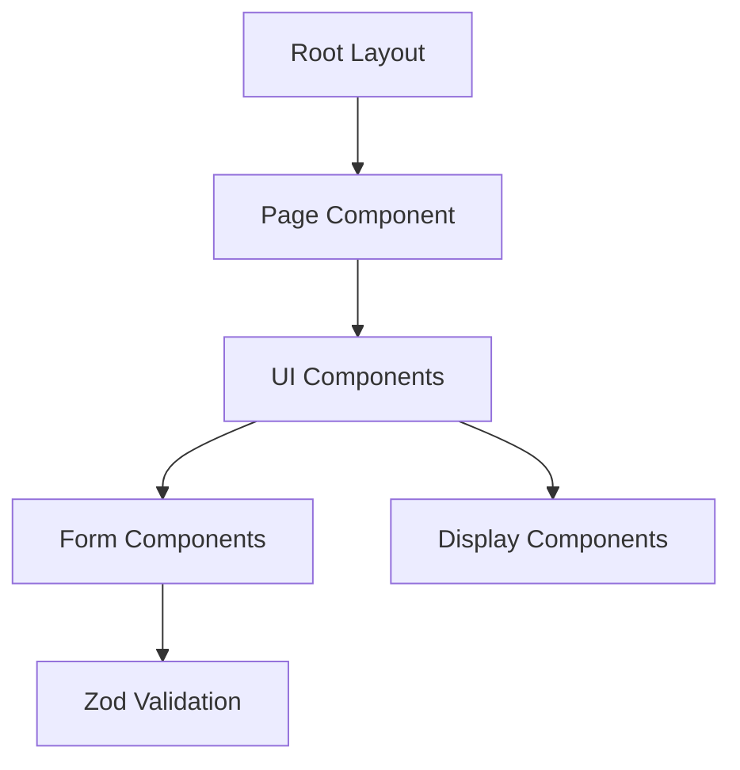
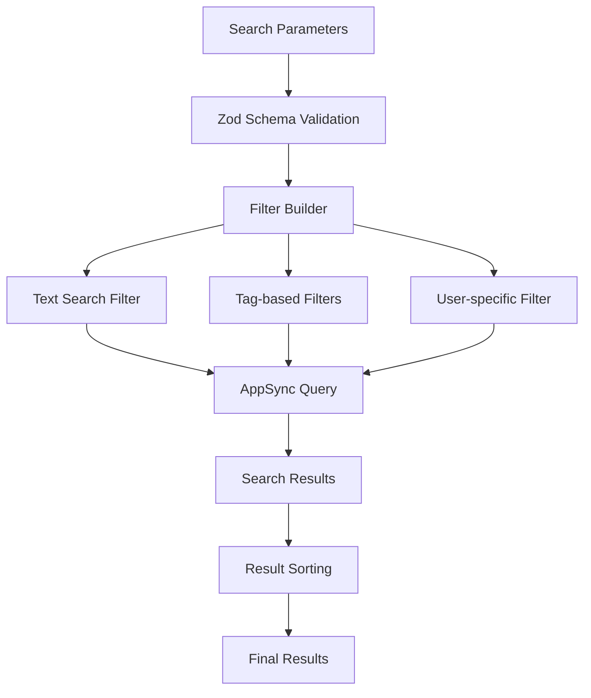

# System Patterns: Promptz

## Architecture Overview

Promptz follows a modern web application architecture using Next.js with AWS Amplify as the backend service provider. The system is designed with the following key architectural patterns:



## Core Design Patterns

### 1. Server Components & Client Components

The application leverages Next.js App Router with a mix of server and client components:

- **Server Components**: Used for data fetching, initial rendering, and SEO optimization
- **Client Components**: Used for interactive elements and client-side state management

### 2. Data Access Pattern



- Server Actions handle data mutations and queries
- AWS AppSync provides a GraphQL interface to the data layer
- DynamoDB stores application data with optimized access patterns

### 3. Authentication Flow



- Amazon Cognito handles user authentication and authorization
- JWT tokens secure API access and protected routes
- Post-authentication triggers handle user profile setup

### 4. Component Hierarchy



- Consistent component structure across the application
- Reusable UI components with clear responsibilities
- Form validation using Zod schema validation

## Data Models

### Prompt Model

The core data entity in the system is the Prompt:

```typescript
type Prompt = {
  id: string;
  name: string;
  description: string;
  instruction: string;
  howto?: string;
  tags?: string[];
  category?: PromptCategory;
  sdlc_phase?: SdlcActivity;
  interface?: QInterface;
  owner: string;
  owner_username: string;
  createdAt: string;
  updatedAt: string;
};
```

### Draft Model

The system also supports drafts for work-in-progress prompts:

```typescript
type Draft = {
  id: string; // Same as the prompt ID it's a draft for
  name: string;
  description: string;
  instruction: string;
  howto?: string;
  tags?: string[];
  owner: string;
  createdAt: string;
  updatedAt: string;
};
```

### User Model

User information is primarily managed by Cognito with additional attributes:

```typescript
type User = {
  id: string;
  displayName: string;
  guest: boolean;
};
```

## API Design

The application uses GraphQL via AWS AppSync with the following core operations:

### Queries

- `getPrompt(id: ID!): Prompt`
- `listPrompts(filter: PromptFilterInput, limit: Int): [Prompt]`
- `getDraft(id: ID!): Draft`

### Mutations

- `createPrompt(input: CreatePromptInput!): Prompt`
- `updatePrompt(input: UpdatePromptInput!): Prompt`
- `deletePrompt(id: ID!): Prompt`
- `createDraft(input: CreateDraftInput!): Draft`
- `updateDraft(input: UpdateDraftInput!): Draft`
- `deleteDraft(id: ID!): Draft`

### Server Actions

The application implements the following server actions for data operations:

- `fetchFeaturedPrompts()`: Retrieves a list of featured prompts for the landing page
- `fetchPrompt(id)`: Retrieves a single prompt by ID
- `fetchPromptForEdit(id)`: Retrieves a prompt for editing, checking for drafts first
- `updatePrompt(prevState, data)`: Updates an existing prompt and deletes any associated draft
- `saveDraft(draft)`: Creates or updates a draft version of a prompt
- `deletePrompt(id)`: Deletes a prompt and any associated draft
- `searchPrompts(params)`: Searches and filters prompts based on query parameters

### Search and Filter Pattern



The search and filter system follows these steps:

1. Validate search parameters using Zod schema
2. Build base filter conditions for public prompts
3. Add text search conditions if query parameter is provided
4. Add tag-based filters for interface, category, and SDLC phase
5. Add user-specific filter if "my" parameter is provided
6. Execute AppSync query with combined filters
7. Sort results based on sort parameter
8. Return mapped prompt results

## Error Handling Strategy

1. **Form Validation**: Client-side validation using Zod schemas
2. **API Error Handling**: Structured error responses from AppSync
3. **UI Error States**: Consistent error messaging and fallback UI components
4. **Error Boundaries**: React error boundaries to contain component failures

## Performance Considerations

1. **Server-Side Rendering**: Critical paths use SSR for optimal loading
2. **Static Generation**: Where possible, pages are statically generated
3. **Incremental Static Regeneration**: For dynamic content that changes infrequently
4. **Optimistic UI Updates**: For improved perceived performance during mutations

## Security Patterns

1. **Authentication**: Cognito handles user identity and access tokens
2. **Authorization**: Fine-grained access control at the AppSync resolver level
3. **Input Validation**: All user inputs are validated before processing
4. **HTTPS**: All communication is encrypted in transit
5. **Resource Protection**: DynamoDB tables have appropriate access controls
