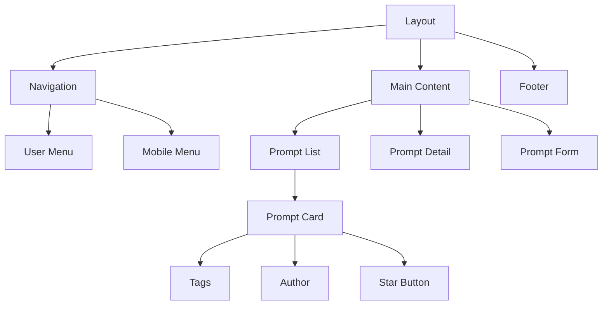

# System Patterns

## Architecture Overview

Promptz follows a modern web application architecture based on Next.js with server components and AWS Amplify for backend services.

## Key Technical Patterns

### Application Structure

- **App Router Pattern**: Uses Next.js App Router for routing and layouts
- **Server Components**: Leverages React Server Components for improved performance
- **Server Actions**: Implements form handling and data mutations using Next.js Server Actions
- **API Layer Abstraction**: Separates API calls into action modules

### Authentication Flow

### Data Management

- **Data Fetching**: Server components fetch data directly
- **Form Handling**: Uses React Hook Form with server actions
- **State Management**: Combines server state with client-side state where needed

### UI Component Hierarchy

## Design Patterns

### Component Patterns

- **Composition**: UI components are composed of smaller, reusable components
- **Container/Presentational**: Separation of data fetching and presentation
- **Render Props**: Used for sharing component logic
- **Custom Hooks**: Encapsulate reusable logic

### Data Patterns

- **Repository Pattern**: Actions files abstract data access
- **Data Transfer Objects**: Defined in definitions.ts
- **Service Layer**: Separates business logic from data access

### Authentication Patterns

- **JWT Authentication**: Using AWS Cognito
- **Protected Routes**: Middleware for route protection
- **Role-Based Access**: Different capabilities for authenticated users

## Testing Strategy

- **Unit Testing**: Jest for testing individual components and functions
- **Component Testing**: React Testing Library for component behavior
- **Snapshot Testing**: For UI component verification
- **Mock Services**: For testing components with external dependencies

## Deployment and Infrastructure

- **AWS Amplify**: For hosting, authentication, and data storage
- **CI/CD Pipeline**: Automated testing and deployment
- **Environment Configuration**: Different settings for development, testing, and production
